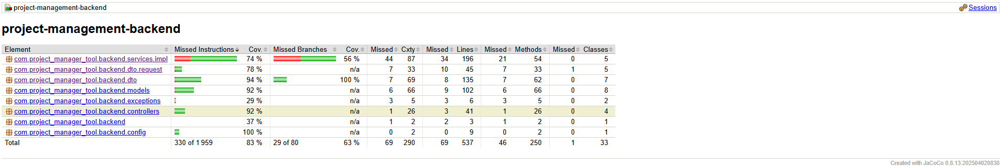

# Outil de Gestion de Projet - Backend (Spring Boot)

## Prérequis

- [Docker](https://www.docker.com/)
- [Docker Compose](https://docs.docker.com/compose/)
- Access to the frontend repository:

---

## Déploiement Docker (Installation locale)

### 1. Cloner les dépôts

```bash
git clone https://github.com/Drezors/project_pmt-backend.git
git clone https://github.com/Drezors/project_pmt-frontend.git
```

### 2. Organiser la structure du projet

```bash
/workspace
  ├── project_pmt-backend
  └── project_pmt-frontend
```

### 3. Aller dans le répertoire backend

```bash
cd project_pmt-backend
```

### 4. Lancer les conteneurs

```bash
docker-compose up --build
```

## Accès aux services

- API Backend: http://localhost:8080
- Interface Frontend : http://localhost:4200
- Documentation API Swagger : http://localhost:8080/swagger-ui.html

## Documentation API

Ce backend utilise SpringDoc OpenAPI pour générer automatiquement une documentation API interactive via Swagger.
Pour y accéder, rendez-vous sur :

http://localhost:8080/swagger-ui.html

## Build et CI/CD

Le projet inclut :

- Backend et frontend dockerisés
- Pipelines GitHub Action CI/CD pour :
  - Construire les images Docker
  - Les pousser sur Docker Hub

## Résultats des tests et couverture

Les résultats des tests unitaires et la couverture de code sont générés automatiquement par Maven/Jacoco et se trouvent dans le dossier target du projet backend : `project_pmt-backend/target/site/jacoco/index.html` (version local) ou directement `project_pmt-backend/site/jacoco/index.html` (pour la vérification).

Pour faciliter la lecture, une **capture d'écran de la couverture** est également incluse dans le repo :



Ouvrez `index.html` dans un navigateur pour naviguer dans le rapport complet avec toutes les classes, méthodes et branches couvertes.
